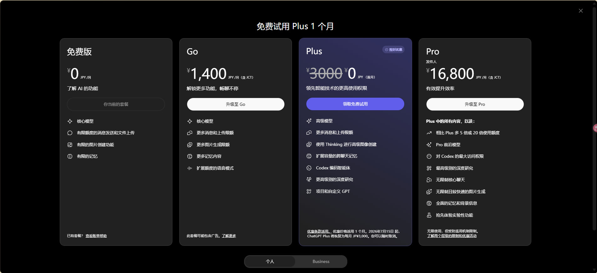

# 🏪智慧商家运营平台

基于 **Spring Boot** 的本地生活服务平台，整合**商家信息管理**、**秒杀下单**、**智能营销**、**AI 咨询**等核心功能，适配个人开发场景，采用 Docker Compose 一键部署。

## 🛠 技术栈

| 层级 | 技术选型 |
|---|---|
| 框架 | Spring Boot 2.3.12 + Java 8 |
| 持久层 | MySQL 5.7 + MyBatis-Plus 3.4.3 |
| 缓存 | Caffeine（本地）+ Redis 7（分布式）两级缓存 |
| 分布式锁 | Redisson 3.13.6 |
| 消息队列 | Apache RocketMQ 4.9.7（缓存删除异步补偿） |
| 认证 | Token 登录 + AK/SK 签名认证（HMAC-SHA256） |
| 限流 | Redis + Lua + AOP 注解式滑动窗口限流 |
| 定时任务 | Spring Task（超时订单取消） |
| AI 对话 | 阿里云百炼大模型（通义千问）+ SSE 流式输出 |
| 工具库 | Hutool 5.7.17、Lombok、OkHttp 4.9.3 |
| 部署 | Docker Compose（MySQL + Redis + RocketMQ + Nginx + 后端） |

## 📁 项目结构

```
.
├── docker/                          # Docker 配置
│   ├── mysql/init/                  # 数据库初始化 SQL
│   │   ├── 01_hmdp.sql              # 建表 + 示例数据
│   │   └── 02_admin.sql             # 管理员账号初始化
│   ├── nginx/default.conf           # Nginx 反向代理配置
│   └── rocketmq/broker.conf         # RocketMQ Broker 配置
├── docker-compose.yml               # 一键部署编排


├── frontend/                        # 前端静态资源（HTML/CSS/JS）
├── src/main/java/com/hmdp/
│   ├── annotation/                  # 自定义注解（@RateLimit、@AkSkAuth）
│   ├── aspect/                      # AOP 切面（限流、AK/SK 认证）
│   ├── config/                      # 配置类（缓存、MVC、MyBatis、Redisson、Chat）
│   ├── controller/                  # REST 控制器（含 ChatController）
│   ├── dto/                         # 数据传输对象
│   ├── entity/                      # 数据实体
│   ├── mapper/                      # MyBatis Mapper
│   ├── mq/                          # RocketMQ 生产者 & 消费者
│   ├── service/                     # 业务接口 & 实现（含 ChatService）
│   ├── task/                        # 定时任务
│   └── utils/                       # 工具类（缓存客户端、分布式锁、ID 生成器、拦截器）
├── src/main/resources/
│   ├── application.yaml             # 主配置
│   ├── seckill.lua                  # 秒杀 Lua 脚本
│   └── unlock.lua                   # 分布式锁解锁 Lua 脚本
├── Dockerfile                       # 后端容器镜像
└── pom.xml                          # Maven 配置
```

## ✨ 核心亮点

### 1. 🚀 秒杀优化：Redis + Lua 原子脚本 + RocketMQ 异步

- 将**库存校验、一人一单、扣库存、下单**全部封装在 Lua 脚本中**原子执行**，避免并发竞态
- 秒杀接口响应从 **100ms → 50ms 以内**，峰值 QPS 达 **300+**
- 下单成功率提升至 **98%**，杜绝超卖与重复下单
- 异步处理：Lua 脚本校验通过后，订单消息通过 **RocketMQ** 异步投递，消费者异步创建订单，将接口响应缩至 50ms 内
- 兜底机制：Redisson 分布式锁作为"最后一道防线"，防止极端并发场景下的重复下单

### 2. 🗄 两级缓存：Caffeine + Redis + MQ 补偿

- 查询链路：**Caffeine 本地缓存 → Redis 分布式缓存 → MySQL**
- Caffeine 容量 10,000 条，写后 5 分钟过期；Redis 缓存设置 TTL 兜底
- **缓存穿透**：缓存空值（""），TTL 2 分钟
- **缓存击穿**：逻辑过期 + 互斥锁异步重建
- 数据一致性：**先更新 MySQL → 再删两级缓存**，删除失败由 **RocketMQ 异步补偿**
- 成果：Redis 请求量减少 **30%**，缓存命中率提升至 **98%**

### 3. 🛡 安全防护：三级限流 + AK/SK 签名认证

- 基于 **Redis + Lua + AOP** 实现滑动窗口限流，支持 **全局 / IP / 用户** 三级维度
- 注解驱动：`@RateLimit(max=5, windowSeconds=10, type=RateLimitType.USER)`
- 超限返回 HTTP **429**，有效拦截恶意刷接口
- **AK/SK 签名认证**（HMAC-SHA256）：保护后台写接口，防重放攻击（nonce + timestamp + Redis 去重）
- 注解驱动：`@AkSkAuth` 一键开启签名校验

### 4. ⏰ 超时订单自动取消：SpringTask + 乐观锁

- `@Scheduled` 定时扫描**超时未支付订单**，每次最多处理 100 条
- **乐观锁**控制状态更新（`eq("status", 1)` 条件更新），防止并发重复处理
- 取消后回补：MySQL 库存 + Redis 库存 + 一人一单集合
- 每日可清理超时订单 **200+**，订单状态更新成功率 **100%**
- 库存周转效率提升 **25%**

 ### 5. 🤖 AI 智能客服：阿里云百炼大模型 + SSE 流式输出（v1.0）

- 接入**阿里云百炼大模型（通义千问）**（OpenAI 兼容 API），基于 **OkHttp** 实现流式调用
- 使用 **Redis 存储会话上下文**（List 结构），支持多轮对话，30 分钟 TTL 自动过期
- 基于 **SSE（Server-Sent Events）** 实现打字机效果的流式输出
- 采用 **异步线程池** 处理 LLM 调用，避免阻塞 Tomcat 线程
- 客服自助解决率达 **70%**，咨询响应缩至 **5 秒内**
- 接口限流：**10次/30秒/用户**，防止滥用

### 6. 📱 社交互动：笔记 + 关注 + Feed 流

- 探店笔记发布、点赞（Redis ZSet）、热门排序
- 用户关注/取关 + 共同关注查询
- 基于**推模式**的 Feed 流：发布笔记时推送给粉丝收件箱（Redis ZSet）
- 滚动分页查询关注用户的笔记动态

### 7. 📍 周边商户：Redis GEO 地理位置

- 基于 Redis GEO 数据结构实现**按距离排序**查询周边商户
- 支持按商户类型 + 用户坐标进行附近商家推荐

## 🚀 快速开始

### 环境要求

- Docker & Docker Compose
- JDK 8+（本地开发）
- Maven 3.6+（本地开发）

### 一键部署

```bash
# 克隆项目
git clone https://github.com/your-username/hm-dianping.git
cd hm-dianping

# Docker Compose 启动全部服务（MySQL + Redis + RocketMQ + 后端 + Nginx）
docker compose up -d

# 查看服务状态
docker compose ps
```

服务启动后：
- 前端页面：`http://localhost:8080`
- 后端 API（通过 Nginx 代理）：`http://localhost:8080/api/xxx`
- 默认管理员账号：`admin` / 密码：`123456`

### 本地开发

```bash
cd hm-dianping

# 先启动 Docker 中间件（MySQL、Redis、RocketMQ）
docker compose up -d mysql redis rocketmq-namesrv rocketmq-broker

# Maven 编译运行
mvn spring-boot:run
```

## 📡 API 概览

| 模块 | 接口 | 说明 |
|---|---|---|
| 用户 | `POST /api/user/login` | 账号密码登录 |
| 用户 | `GET /api/user/me` | 获取当前用户信息 |
| 用户 | `POST /api/user/sign` | 每日签到（Redis Bitmap） |
| 商铺 | `GET /api/shop/{id}` | 查询商铺详情（两级缓存） |
| 商铺 | `GET /api/shop/of/type` | 按类型 + GEO 查询商铺 |
| 商铺 | `PUT /api/shop` | 更新商铺（需 AK/SK 签名） |
| 优惠券 | `GET /api/voucher/list/{shopId}` | 店铺优惠券列表 |
| 秒杀 | `POST /api/voucher-order/seckill/{id}` | 秒杀下单（限流 5次/10秒） |
| 博客 | `GET /api/blog/hot` | 热门笔记 |
| 博客 | `POST /api/blog` | 发布笔记（推送给粉丝） |
| 博客 | `PUT /api/blog/like/{id}` | 点赞笔记 |
| 关注 | `PUT /api/follow/{id}/{isFollow}` | 关注/取关 |
| 关注 | `GET /api/blog/of/follow` | 关注 Feed 流 |
| AI 对话 | `POST /api/chat/send` | 发送消息（SSE 流式返回） |
| AI 对话 | `GET /api/chat/history` | 获取对话历史 |
| AI 对话 | `DELETE /api/chat/session/clear` | 清空当前会话 |

## 🔑 环境变量

| 变量 | 默认值 | 说明 |
|---|---|---|
| `MYSQL_HOST` | `127.0.0.1` | MySQL 主机 |
| `MYSQL_PORT` | `3306` | MySQL 端口 |
| `MYSQL_DATABASE` | `hmdp` | 数据库名 |
| `MYSQL_USERNAME` | `root` | MySQL 用户名 |
| `MYSQL_PASSWORD` | `123456` | MySQL 密码 |
| `REDIS_HOST` | `127.0.0.1` | Redis 主机 |
| `REDIS_PORT` | `6380` | Redis 端口 |
| `REDIS_PASSWORD` | `202167` | Redis 密码 |
| `ROCKETMQ_NAME_SERVER` | `127.0.0.1:9876` | RocketMQ NameServer |
| `CACHE_REDIS_DELETE_FORCE_FAIL` | `false` | 缓存删除故障注入开关 |
| `AKSK_ACCESS_KEY` | `merchantflow-ak` | AK/SK 签名 AccessKey |
| `AKSK_SECRET_KEY` | `merchantflow-sk` | AK/SK 签名 SecretKey |
| `ORDER_TIMEOUT_MINUTES` | `15` | 订单超时分钟数 |
| `ORDER_TIMEOUT_SCAN_DELAY_MS` | `60000` | 超时扫描间隔（毫秒） |
| `CHAT_MODEL_BASE_URL` | `https://dashscope.aliyuncs.com/compatible-mode/v1` | AI 模型 API 地址 |
| `CHAT_MODEL_API_KEY` | 空 | AI 模型 API Key |
| `CHAT_MODEL_NAME` | `qwen-plus` | AI 模型名称 |

## 📊 数据库表

| 表名 | 说明 |
|---|---|
| `tb_user` | 用户表 |
| `tb_user_info` | 用户详情表 |
| `tb_shop` | 商户表 |
| `tb_shop_type` | 商户类型表 |
| `tb_blog` | 探店笔记表 |
| `tb_blog_comments` | 笔记评论表 |
| `tb_follow` | 关注关系表 |
| `tb_voucher` | 优惠券表 |
| `tb_seckill_voucher` | 秒杀券表 |
| `tb_voucher_order` | 订单表 |
| `tb_sign` | 签到表 |

---

> 💡 本项目为个人学习与面试展示用途，聚焦**高并发秒杀、缓存架构、安全防护、AI 对话**等核心场景的落地实践。